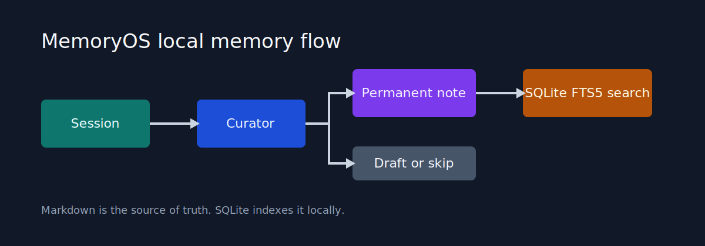
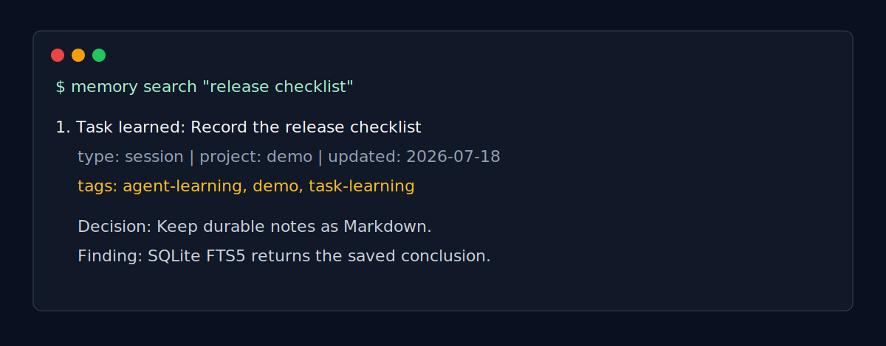
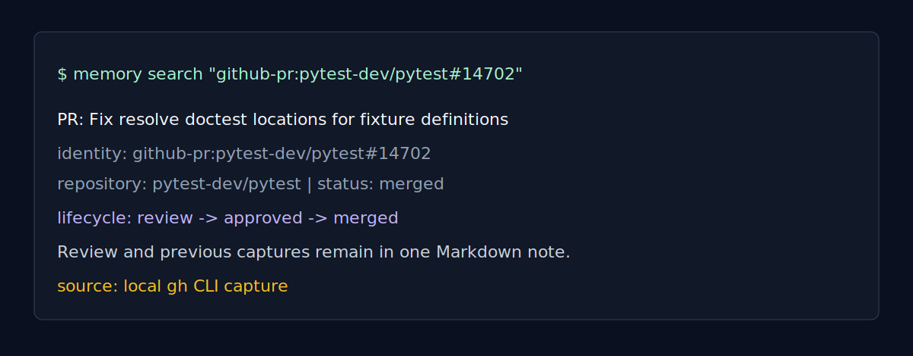
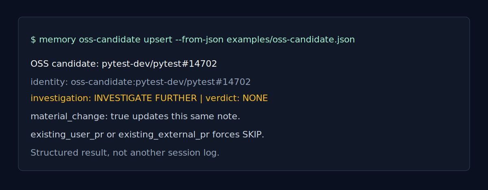

# MemoryOS

[](https://github.com/vetrovk/memoryos/actions/workflows/ci.yml)
[](LICENSE)
[](https://github.com/vetrovk/memoryos/tags)

MemoryOS is a local-first engineering memory system built for OpenAI Codex, keeping decisions, task outcomes, and investigation context searchable after a project session ends.

It was created around daily Codex engineering workflows. It helps when Codex has already investigated a failure, reviewed a pull request, or rejected an OSS candidate, but the next task has to repeat that work because the useful conclusion was lost in a terminal, chat, or commit history.

## Primary Target

- Built for OpenAI Codex.
- Used daily in real engineering workflows with Codex.
- Designed for persistent engineering knowledge, not chat-history storage.

MemoryOS is an independent open-source project. It is not made by, operated by, or affiliated with OpenAI. `OpenAI` and `Codex` are trademarks of OpenAI and are used here only to identify the external tool MemoryOS targets.



## What It Does

- Captures structured task learning through a Python API or `memory learn`.
- Collects a local Git session with `memory learn --from-session`.
- Curates session records into permanent notes, drafts, or skips when the signal is weak or duplicated.
- Stores GitHub pull-request context and lifecycle updates in one durable note per PR.
- Stores one structured OSS candidate decision per repository issue.
- Imports local `.memoryos_pending/*.json` records from agent workflows.
- Keeps Markdown as the source of truth and SQLite FTS5 as the local search index.

No cloud service, external API, or LLM is required for the core workflow. GitHub PR capture optionally uses the locally configured `gh` CLI.

## Agent Compatibility

| Agent | Current status |
| --- | --- |
| OpenAI Codex | Primary supported workflow; used daily. |
| ChatGPT Codex Work | Used in production through session learning and pending-record import. |
| Claude Code | Not tested by this project. |
| Gemini CLI | Not tested by this project. |
| Other coding agents | Possible through the CLI or Python API, but not a primary focus. |

## How It Works

```text
OpenAI Codex
        |
      Session
        |
      Curator
   /    |     \
skip  draft  permanent Markdown note
                    |
              SQLite FTS5 search
```

Permanent notes are human-readable Markdown. SQLite indexes notes, tags, links, aliases, commands, and history so the same memory is both inspectable and searchable.

## Install

Requirements: Python 3.9 or newer, plus Git for session capture. GitHub PR capture additionally needs the GitHub CLI `gh`.

```bash
git clone https://github.com/vetrovk/memoryos.git
cd memoryos
python3 -m venv .venv
. .venv/bin/activate
python -m pip install -e .
memory --help
```

The repository contains the engine only. Keep your actual memory folder outside the repository.

## Quick Start

This creates a disposable local memory, saves one engineering conclusion, and finds it again.

```bash
export MEMORY_HOME="$PWD/.memory-demo"
memory init

memory learn \
  --project demo \
  --goal "Record the release checklist" \
  --action "Created a local MemoryOS demo" \
  --decision "Keep durable notes as Markdown" \
  --finding "SQLite FTS5 returns the saved conclusion" \
  --actor developer \
  --source manual

memory search "release checklist"
```

The command creates Markdown under `$MEMORY_HOME` and updates its SQLite index immediately. Remove `.memory-demo/` when you no longer need the example.

To preview automatic session capture without saving a note:

```bash
memory learn --from-session --actor codex --source codex --dry-run
```

To prepare a compact, read-only handoff for a known project:

```bash
memory context memoryos --session
memory context memoryos --session --limit 8 --max-bytes 4096
```

Session context is opt-in. It uses existing project memory only, writes nothing, starts no hooks or background process, and reports its actual UTF-8 size and truncation state. After a permanent `memory learn --from-session` save, MemoryOS verifies the Markdown file, metadata, SQLite index, and normal search retrieval before reporting success.

If an agent cannot write the configured memory home because of a readonly database or sandbox boundary, the Codex workflow can leave a Codex Work JSON record in `.memoryos_pending/` inside the project. Import it later with `memory import-pending`; successful files are archived beside their source. MemoryOS does not send this data to a cloud service.

## Examples

### Search a saved decision

```bash
memory search "SQLFluff"
memory search --project memoryos
```



### Keep one evolving GitHub PR memory

```bash
memory github-pr https://github.com/pytest-dev/pytest/pull/14702
memory search "github-pr:pytest-dev/pytest#14702"
memory github-pr-deduplicate --dry-run
```

The `github-pr` command reads an accessible PR through `gh`. Repeated captures update the same note, identified as `github-pr:<owner>/<repo>#<number>`, and record its lifecycle in local history.



### Record an OSS investigation

```bash
memory oss-candidate upsert --from-json examples/oss-candidate.json
memory search "oss-candidate:pytest-dev/pytest#14702"
```

`existing_user_pr` and `existing_external_pr` force a `SKIP` verdict. Repeating `INVESTIGATE FURTHER` without `material_change: true` is skipped instead of creating another activity log entry.



### Import local agent records

By default, `memory import-pending` recursively searches `~/Documents` for files matching `.memoryos_pending/*.json`. It reads only those matching pending JSON files, not arbitrary documents. To avoid scanning all of `~/Documents`, pass one or more explicit project roots with `--path`.

```bash
memory import-pending --dry-run
memory import-pending --dry-run --path "/path/to/projects"
memory import-pending --path "/path/to/projects" --days 7
```

`--dry-run` does not import, move, or delete files. Successful files are indexed and moved to a sibling `.memoryos_pending/archive/` folder. Failed JSON files stay in place and are logged locally.

## Activity Log Vs. Memory

Not every command, changed file, or empty session deserves permanent memory. The Curator scores session signals, filters generated files, detects duplicates and near-duplicates, and either saves a permanent note, creates a draft, or explains why it skipped the session.

```bash
memory drafts
memory drafts review
memory curator-stats --days 7
memory cleanup-generated --dry-run
```

## Why This Shape

MemoryOS stores decisions and outcomes rather than a raw conversation history. Markdown remains portable and reviewable in Git or an editor, while SQLite FTS5 makes those notes practical to retrieve during the next task.

## Privacy

- Core data stays on the local filesystem selected by `MEMORY_HOME`, or `~/Memory` by default.
- Do not commit a real memory folder, SQLite database, logs, exports, drafts, pending records, or `.env` files.
- The optional `memory github-pr` command calls your local `gh` CLI. It does not send local MemoryOS notes to GitHub.

See [PRIVACY.md](PRIVACY.md) and [.gitignore](.gitignore).

## Local Data Lifecycle

MemoryOS has no bulk-delete command. Archive or remove local Markdown notes with normal filesystem tools, then run `memory rebuild` to recreate the SQLite index from the remaining notes. Rebuild reports incomplete indexing with a non-zero exit code and leaves failed Markdown notes untouched. Back up important local memory before upgrading a beta release.

## Documentation

- [CLI reference](CLI.md)
- [Architecture](ARCHITECTURE.md)
- [Database and search model](DATABASE.md)
- [Plugin API](PLUGIN_API.md)
- [Contributing](CONTRIBUTING.md)
- [Security policy](SECURITY.md)
- [Changelog](CHANGELOG.md)

## Current Status

MemoryOS v0.2.0 is an actively used public beta. The command-line workflow and Markdown format are usable now; the Python API and note schema may still change before a stable 1.0 release. Bug reports and focused issues through GitHub Issues, plus small pull requests, are welcome.

## Development

```bash
python -m unittest discover -s tests -v
PYTHONPYCACHEPREFIX=/tmp/memoryos-pycache python -m compileall memoryos
python -m memoryos.cli doctor --home /tmp/memoryos-doctor
```
